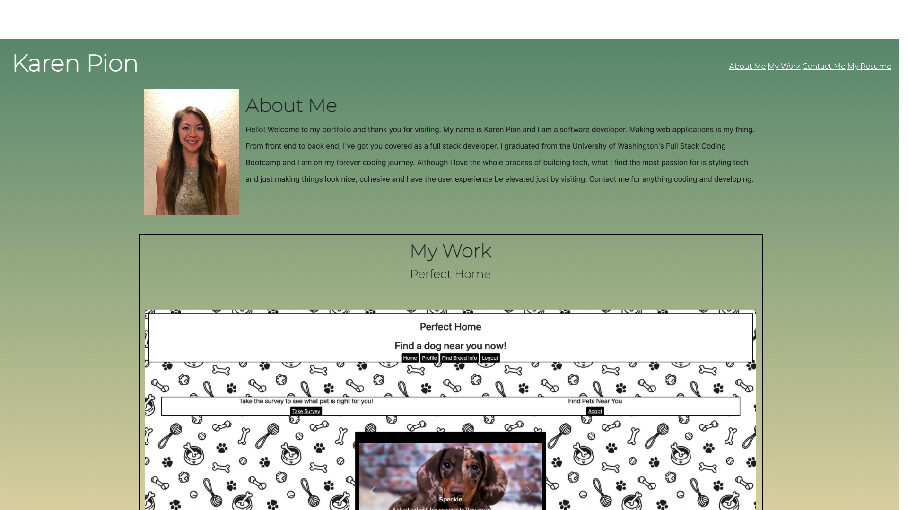

# My Professional Portfolio

This webpage displays my projects in a professional manner so that a potential employer may view and go through what I have previously created.

They'll also be able to find my contact information, my resume and a short section about who I am and characteristics of my individual personality that may be of benefit to them.

One can easily navigate my porfolio, not only by using the navigation bar but also by clicking on the projects themselves which will connect them to my deployed projects. See below:

# Sample Image

# Deployed Page
Find my professional portfolio [here](https://ksapir.github.io/portfolio/).

# Resources
This Portfolio was made possibe by the content that was taught in Bootcamp from Week 1. The following are additional resources that were helpful in my process.
- [W3Schools](https://www.w3schools.com/)
- [CSS Tricks](https://css-tricks.com/)
- [Stack Overflow](https://stackoverflow.com/)
- [Career Karma](https://careerkarma.com/)

